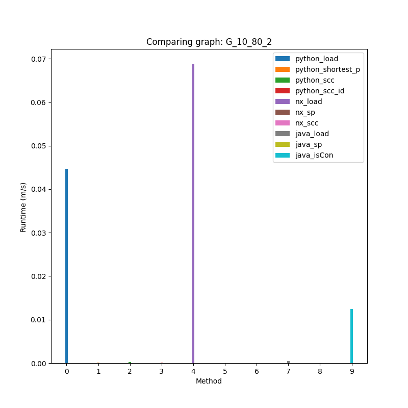

# Ex3 - Un-directed weighted graph in Python

Assignment 3 in OOP course, Ariel university 2021.

In this assignment we will present an un-directed weighted graph implemented
in python 3.


## Installation and Prerequisites

Use the package manager [pip](https://pip.pypa.io/en/stable/) to install [matplotlib](https://matplotlib.org/3.1.1/index.html).

```bash
pip install matplotlib
```

## Comparison

We will compare our implementation compared to our Java implementation done in [Ex2](https://github.com/SeanPeer/Ex2-Pokemon1).

Also, we will compare our Graph to [Networkx](https://networkx.org/documentation/latest/) solution.

All the comparisons can be found in the [Wiki!](https://github.com/SeanPeer/Ex3_OOP/wiki).

My pc specs are: <br/>
#### CPU - i7 6700k (4 cores 8 threads)<br/>
#### RAM - 16GB RAM DDR4<br/>
#### GPU - Geforce GTX 980Ti<br/>

### visual comparison

using matplotlib we can show each element's runtime, segmented by files.<br/>
for example:


## Visualization

A graphic representation of the graph, using matplotlib.


## Usage
Using a Graph.
```python
# construct a graph
g = DiGraph()

# add nodes
for i in range(5):
    g.add_node(i)

# add edges, with weights
g.add_edge(0, 1, 1)
g.add_edge(0, 2, 1)
g.add_edge(1, 2, 2)

# remove a node
g.remove_node(3)

# remove an edge
g.remove_edge(0, 1)

# get |V|
g.v_size()

# get |E|
g.e_size()

# get in edges of node id
g.all_in_edges_of_node(id)

# get out edges from node id
g.get_out_edges_of_nodes(id)
```

using Graph Algorithms:
```python
# construct an algo initialized with graph g.
algo = GraphAlgo(g)

# construct an algo without initializiation. (requires load to use graph features).
# using load_from_json to load a graph from a json
# expecting the following format: {"Edges": [{"src":s, "dest":d, "w":w}], 'Nodes': [{"id":id, "pos":pos}]
# note: pos argument for a node is optional.
algo = GraphAlgo()
algo.load_from_json(file_path)

# save current algo's graph to a json file
algo.save_to_json(file_path)

# calculate shortest path between two nodes
# returns shortest distance, and shortest path.
dist, path = algo.shortest_path(src, dest)

# get all Strongly connected components in the graph
components = algo.connected_components()

# get all Strongly connected components to a given node 
component = algo.connected_component(id)

# plot the graph with matplotlib
algo.plot_graph()
```

## Contributing
Pull requests are welcome. For major changes, please open an issue first to discuss what you would like to change.

Please make sure to update tests as appropriate.

