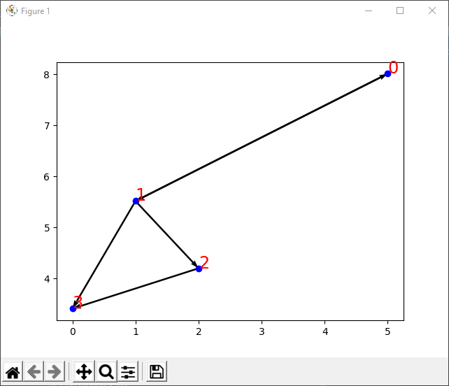

# Ex3 - Un-directed weighted graph in Python

Assignment 3 in OOP course, Ariel university 2021.

In this assignment we will present an un-directed weighted graph implemented
in python 3.


## Installation and Prerequisites

Use the package manager [pip](https://pip.pypa.io/en/stable/) to install [matplotlib](https://matplotlib.org/3.1.1/index.html).

```bash
pip install matplotlib
```

## Comparison

We will compare our implementation compared to our Java implementation done in [Ex2](https://github.com/SeanPeer/Ex2-Pokemon1).

Also, we will compare our Graph to [Networkx](https://networkx.org/documentation/latest/) solution.

All the comparisons can be found in the [Wiki!](https://github.com/SeanPeer/Ex3_OOP/wiki).

### visual comparison

using matplotlib we can show each element's runtime, segmented by files.


## Visualization

A graphic representation of the graph, using matplotlib.





## Usage

```python
# construct a graph
g = DiGraph()

# add nodes
for i in range(5):
    g.add_node(i)

# add edges, with weights
g.add_edge(0, 1, 1)
g.add_edge(0, 2, 1)
g.add_edge(1, 2, 2)

# remove a node
g.remove_node(3)

# remove an edge
g.remove_edge(0, 1)

# get |V|
g.v_size()

# get |E|
g.e_size()

```

## Contributing
Pull requests are welcome. For major changes, please open an issue first to discuss what you would like to change.

Please make sure to update tests as appropriate.

